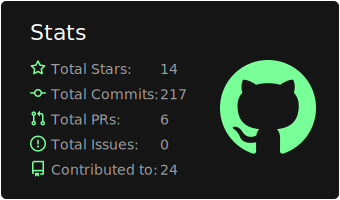
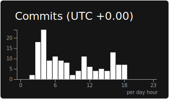
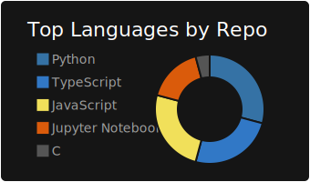
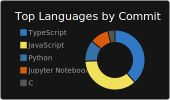
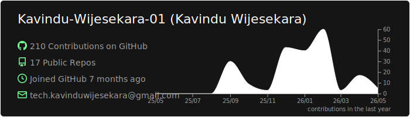

<h1 align="center">
Hi , I'm Kavindu Wijesekara
</h1>

<h3 align="center">🚀 A Passionate IT Student from Sri Lanka</h3>

  

  
##  About Me

  

####
I am Kavindu Wijesekara, an Information Systems undergraduate pursuing a BSc (Hons) at Sabaragamuwa University of Sri Lanka. With a deep-rooted passion for the intersection of Artificial Intelligence and Software Engineering, I am focused on building scalable and intelligent digital solutions.
####
Currently, I am actively involved in developing SaaS applications and architecting systems using microservices. To bridge the gap between development and production-grade AI, I am also specializing in MLOps, ensuring that machine learning models are efficiently deployed and managed. My ultimate career objective is to evolve into a specialist in the AI-driven technology landscape, leveraging automation and advanced data processing to solve complex real-world challenges.

---

## 🔥 My Statistics

<kbd>

</kbd>

 

 <kbd>
  
 </kbd>

 <kbd>
  
 </kbd>

   
  
  

## 🗂️ Repositories & Languages

  <kbd>
    
  </kbd>

  <kbd>
    
  </kbd>

  

##    Technologies & Tools 

  <h3>🌐 Frontend & Backend</h3>
  <table align="center">
  <tr>
    <td align="center" width="700">
      
      
      
      
       
      
      
      
      
       
      
      
      
      
      
    </td>
  </tr>
  </table>

  <h3>🤖 AI & Machine Learning</h3>
  <table align="center">
  <tr>
    <td align="center" width="700">
      
      
      
       
      
      
    </td>
  </tr>
  </table>

  <h3>⚙️ DevOps & MLOps</h3>
  <table align="center">
  <tr>
    <td align="center" width="700">
      
      
      
       
      
      
       
      
      
      
    </td>
  </tr>
  </table>

  <h3>🛠️ Languages & Tools</h3>
  <table align="center">
  <tr>
    <td align="center" width="700">
      
      
      
      
      
      
      
       
      
      
      
      
      
    </td>
  </tr>
  </table>

## 📈 Contribution Graph

  <kbd>
  
  </kbd>

---

## 🤝 Connect With Me

  

---

